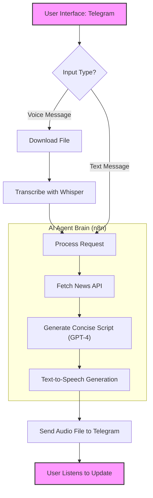

# 🎙️ AI Audio Generation & Text-to-Speech (TTS) - The Complete Guide

> **Master the Art of Voice AI**: From Industry Applications to Building Your Own Audio Agents

This comprehensive guide explores the rapidly evolving world of AI voice generation, featuring deep dives into industry leaders like **ElevenLabs** and **OpenAI**, real-world case studies, and a practical tutorial on building an automated news-reading agent using **n8n**.

---

## 📋 Table of Contents

1. [Introduction to AI Audio](#introduction-to-ai-audio)
2. [Key Players: ElevenLabs & OpenAI](#key-players-elevenlabs--openai)
3. [Industry Use Cases at Scale](#industry-use-cases-at-scale)
4. [Tutorial: Building an AI News Agent with n8n](#tutorial-building-an-ai-news-agent-with-n8n)
5. [Future of Voice AI](#future-of-voice-ai)

---

## 1. Introduction to AI Audio 

Generative AI has transformed audio from simple text-to-speech (TTS) into emotive, realistic, and context-aware voice synthesis. Today's models can:

- Clone voices with just a few seconds of audio.
- Speak in dozens of languages with native accents.
- Convey complex emotions like whispering, shouting, or laughing.
- Generate sound effects and background music (as seen in tools like Suno/Udio).

---

## 2. Key Players: ElevenLabs & OpenAI 

### 🗣️ ElevenLabs

**ElevenLabs** is currently the industry standard for high-quality, emotionally rich AI speech.

- **Best For**: Premium voiceovers, storytelling, dubbing, and personalized content.
- **Key Features**:
  - **Voice Cloning**: Create a digital replica of your own voice.
  - **Multilingual Synthesis**: Auto-translate content while preserving the original speaker's voice.
  - **Speech-to-Speech**: Modify the style of an existing audio track.
  - **Sound Effects Generation**: Create SFX from text prompts.

### 🤖 OpenAI TTS

**OpenAI's Text-to-Speech API** offers a robust, developer-friendly solution.

- **Best For**: Real-time applications, chatbots, and reliable, standard voices.
- **Key Voices**: Alloy, Echo, Fable, Onyx, Nova, and Shimmer.
- **Advantages**: seamless integration with GPT-4 and low latency usage.

---

## 3. Industry Use Cases at Scale 

How are major companies leveraging AI voice technology today?

### 👔 Recruitment & Hiring (Apna)

*Automating the interview process for millions.*

- **Scale**: Delivered **7.5 million AI interview minutes**.
- **Performance**: Achieved **sub-300ms latency** for natural conversation flow.
- **Innovation**: Deployed **500 million custom "micro-models"** to conduct role-specific interviews for massive hiring drives.

### 🚗 Automotive & Sales (Cars24)

*Enhancing customer support and sales efficiency.*

- **Impact**: **35% uplift in conversation quality** using AI transcription ("Scribe") analysis.
- **Goal**: Assist sales teams with large call volumes and reduce customer wait times.
- **Result**: **~20% improvement in Customer Satisfaction (CSAT)** scores.

### 🛍️ E-commerce & Support (Meesho)

*Handling high-volume customer queries.*

- **Volume**: **60,000 automated calls daily** managed by voicebots (English & Hindi).
- **Focus**: Prioritizing "clarity, warmth, and tone" to build trust.
- **Strategy**: strategic multilingual infrastructure for real-time order updates, cancellations, and refunds.

### 🎬 Media & Entertainment (Hoichoi & Meta)

*Globalizing content through automated dubbing.*

- **Efficiency**: **60% reduction in dubbing timelines** (from ~5 days to ~2 days).
- **Reach**: Localization for billions of users across languages.
- **Asset Library**: Access to **11,000+ expressive voices** to match specific character tones and cultural nuances.

---

## 4. Tutorial: Building an AI News Agent with n8n 

Let's build a practical implementation: An **Auto-News Agent** that takes a request from Telegram, finds the latest news, and sends back a professionally narrated audio summary.

### 🛠️ The Architecture

We will use **n8n** (a workflow automation tool) to connect Telegram, OpenAI (GPT-4), and a TTS engine (ElevenLabs or OpenAI).

#### **Workflow Logic:**

1. **User sends message** (Voice or Text) on Telegram.
2. **Transcribe capability** (Whisper) converts voice execution to text.
3. **AI Agent** processes the request and fetches live news.
4. **Script Generation** (GPT-4) writes a concise summary.
5. **Voice Generation** (TTS) converts the script to audio.
6. **Delivery** sends the audio file back to the user.

### 📊 System Diagram

### 🔧 Step-by-Step Implementation

1. **Telegram Trigger Node**: Listen for new messages. Use an `If` node to check if the message contains voice or text.
2. **Whisper Node (if Voice)**: Connect your OpenAI API key. Set the input to the downloaded file URL from Telegram.
3. **AI Agent Node**:
    - Connect a **Chat Model** (e.g., GPT-4o-mini).
    - Connect a **Tool** (HTTP Request) to call a News API (like NewsAPI.org or GNews).
    - **System Prompt**: *"You are a news anchor. Search for the latest news on [User Topic], write a 3-sentence summary, and output only the text summary."*
4. **Text-to-Speech Node**:
    - Input: Output from the AI Agent.
    - Service: ElevenLabs (use a "News Anchor" voice ID) or OpenAI (use "Onyx").
5. **Telegram Output Node**:
    - Action: Send Audio File.
    - Input: Binary data from the TTS node.

---

## 5. Future of Voice AI 

As we look ahead, the line between human and machine audio is blurring completely.

- **Real-Time Latency**: Approaching human reaction times (sub-200ms).
- **Emotional Intelligence**: AI that can detect user frustration or happiness and adjust its tone instantly.
- **Hyper-Personalization**: Audiobooks read by your favorite celebrity (licensed) or even a passed loved one (with consent).

> **Explore More**: Check out the [AI Music Generation Guide](./AI_Music_Generation_Ready_Reckoner.md) to see how similar technologies are transforming music creation.
